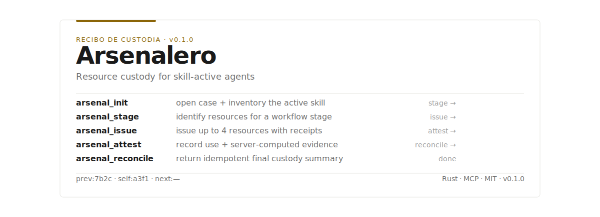
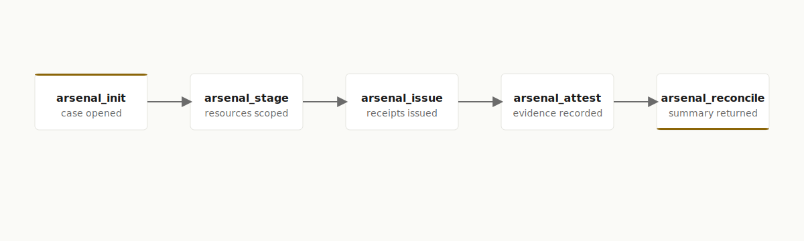

<p align="center">
  
</p>

<h3 align="center">
  Rust &nbsp;·&nbsp; MCP over stdio &nbsp;·&nbsp; MIT &nbsp;·&nbsp; 70 tests &nbsp;·&nbsp; CI &nbsp;·&nbsp; <code>unsafe</code> forbidden
</h3>

---

## What it is

**Arsenalero** is a local MCP server, written in Rust, that provides **resource custody for AI agents after a skill is activated**. It runs over stdio, ships as a Codex plugin, and records who received which resources and how they were used.

Arsenalero is an **observer, not an enforcer**. It never blocks, mutates, or judges agent behavior. It does not activate skills, does not control workflows, and does not access the filesystem or network during scanning. It opens a custody case, inventories the active skill, issues resources with receipts, records evidence, and returns a final summary the agent surfaces to the user.

## Why it's different

- **Observer, not enforcer.** Arsenalero records custody; it never blocks, mutates, or forces agent behavior. (ADR 0003)
- **Deterministic classification.** Resources are classified via closed vocabularies with **zero LLM calls**. The same input always yields the same classification. (ADR 0002)
- **Hash-chained append-only journal.** Every receipt links `prev → self → next`, so the custody trail is tamper-evident.
- **Global MCP server.** One stdio server serves any agent that speaks MCP; the plugin metadata points at the same reproducible `cargo` command. (ADR 0001)
- **Agentic constitution.** The server's behavior is governed by a written agentic constitution, documented in `AGENTIC-CONSTITUTION-v1.0.md`.

## How it works

<p align="center">
  
</p>

After a skill is already active, the agent drives a single custody case through five steps. Each step has one clear next step, and every issued receipt is chained into an append-only journal (`prev → self → next`). The flow is strictly linear and idempotent at the end: `arsenal_reconcile` can be called repeatedly and returns the same final custody summary.

## The five tools

| Tool | Purpose | Precondition | Next step |
|------|---------|--------------|-----------|
| `arsenal_init` | Open a resource-custody case and inventory the active skill | The skill is already active and its absolute root is supplied | `arsenal_stage` |
| `arsenal_stage` | Identify resources relevant to a declared workflow stage | A ready case exists | `arsenal_issue` |
| `arsenal_issue` | Issue up to four inventoried resources with case-bound receipts | A ready case and known resource IDs | `arsenal_attest` |
| `arsenal_attest` | Record use of issued receipts and server-computed evidence level | Same-case current receipts and non-empty usage | `arsenal_reconcile` |
| `arsenal_reconcile` | Return an idempotent final custody summary | A case exists | Surface the summary to the user |

These descriptions are taken verbatim from the tool definitions in `crates/arsenalero-mcp/src/server.rs`.

## Quickstart

Arsenalero is **not published to crates.io as a standalone binary**. First use requires the Rust toolchain, a clone, a build, and pointing an MCP client at the stdio server.

**1. Clone and build**

```sh
git clone <repo-url> arsenalero
cd arsenalero
cargo build --locked --package arsenalero-mcp
```

**2. Point an MCP client at the server**

The repo ships a `.mcp.json` that runs the server from source via `cargo`:

```json
{
  "mcpServers": {
    "arsenalero": {
      "cwd": ".",
      "command": "cargo",
      "args": ["run", "--locked", "--package", "arsenalero-mcp"]
    }
  }
}
```

Use it as a Codex plugin via `.codex-plugin/plugin.json` (which references `./.mcp.json`), or add the same server entry to your own MCP client configuration. The server speaks MCP over standard input/output and exits when the transport closes.

**Known gap — no `--version` flag.** The binary does not implement a `--version` flag. To confirm you are running the build you expect, check the workspace version in `Cargo.toml` (`0.1.0`) or use `cargo run --package arsenalero-mcp` from the intended checkout.

## Evaluation & rigor

Arsenalero is built to be research-grade, with reproducible evaluation and auditable governance.

- **Evaluation contract:** `evals/` defines a fixed matrix of **20 cases × 3 arms × 3 trials (180 runs)**, with `pass@3` (at least one of three trials succeeds) and `pass^3` (all three trials succeed) metrics, plus a locked-regression **anti-tuning rule** so cases cannot be tuned to the implementation. See `evals/README.md`, `evals/cases.jsonl`, and `evals/labels.jsonl`.
- **Safety by construction:** `unsafe_code = "forbid"` is enforced at the workspace level in the root `Cargo.toml`, and the binary repeats `#![forbid(unsafe_code)]`.
- **CI (`.github/workflows/ci.yml`):** `cargo fmt --check`, `cargo check --workspace --locked`, `cargo clippy -D warnings`, `cargo test --workspace`, and `cargo-deny`.
- **Evidence:** plugin install and smoke-test evidence is recorded in `docs/evidence/plugin-smoke-test.md`.
- **Audit trail:** governance, ADRs, security, audit, and evidence documents live under `docs/`.

## Architecture

```text
crates/arsenalero-core/   # Domain contracts, path policy, scanner, classification, journal
crates/arsenalero-mcp/    # stdio MCP server + the five tool handlers
docs/                     # Governance, ADRs, security, evidence, audit
.codex-plugin/            # Codex plugin metadata
.mcp.json                 # Local cargo-run MCP configuration
```

- Decisions: `docs/adr/0001-global-mcp.md`, `docs/adr/0002-deterministic-classification.md`, `docs/adr/0003-observer-not-enforcer.md`
- Design baseline: `docs/architecture/ARSENALERO_MCP_SDD_v1.3.md`
- Security: `docs/security/threat-model.md`
- Evaluation: `evals/README.md`

## Limitations

Arsenalero is deliberately narrow. These constraints are by design, not gaps to be hidden.

- **stdio-only.** The server speaks MCP over standard input/output. There is no network listener.
- **Local.** It runs on your machine against a skill root you explicitly authorize; the skill root is a read-only input.
- **Observer, not enforcer.** Arsenalero reports custody state (missing calls, stale receipts, digest drift, unresolved resources). It does not block, intercept, mask tools, execute validators, or judge the primary task result.
- **No standalone published binary.** It is not on crates.io as a standalone binary; first use requires a Rust toolchain and a build from source.
- **No `--version` flag** on the binary (see Quickstart).

## Contributing, Security, License

- Contributing: see [`CONTRIBUTING.md`](./CONTRIBUTING.md)
- Security: see [`SECURITY.md`](./SECURITY.md)
- Governance: see [`AGENTIC-CONSTITUTION-v1.0.md`](./AGENTIC-CONSTITUTION-v1.0.md)
- License: **MIT** — see [`LICENSE`](./LICENSE)
